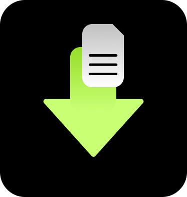

<div align="center">
  
  <h1>Dload (Containerized Download Manager)</h1> 
</div>

Dload, A download manager that runs inside a docker container

# Quick Setup

1. Install [Docker](https://docs.docker.com/engine/install/)
2. Run the following command to quickly create dload container:
```bash
docker run -d \
  --name=dload \
  -e PUID=1000 \
  -e PGID=1000 \
  -p 8080:80 \
  -v ./config:/config \
  -v ./downloads:/downloads \
  --restart unless-stopped \
  fuzzknob/dload
```
### With Docker Compose

1. Create `docker-compose.yml` file with this contents:
```yml
version: "3"

services:
  dload:
    container_name: dload
    image: fuzzknob/dload
    environment:
      - PUID=1000
      - PGID=1000
    volumes:
      - ./config:/config
      - ./downloads:/downloads
    ports:
      - 8080:80
    restart: unless-stopped
```

2. Run the following command:
```bash
docker compose up -d
```

You can access the dload UI at http://localhost:8080

# Screenshots

### Main Page


### Add Download


### Settings


# Development

For development you can either use [vscode devcontainer](https://code.visualstudio.com/docs/devcontainers/containers). Or run it locally with Node.js.

### Devcontainer (Recommended)
Just open this project in devcontainer and run:
```bash
yarn dev
```
You can access the client in http://localhost:8080

### Local (Not Recommended)
To run it locally you will need to have the following tools:
* [Node.js (18 or above)](https://nodejs.org/)
* [yarn (1.22.19)](https://classic.yarnpkg.com/en/docs/install)

But before we run the app we need to change somethings:

1. Change the url at [client/request.ts:L4](https://github.com/fuzzknob/dload/blob/main/apps/client/src/libs/request.ts#L4) to http://localhost:8000 and add ws://localhost:8000 at [client/socket.ts:L3](https://github.com/fuzzknob/dload/blob/main/apps/client/src/libs/socket.ts#L3)
2. Replace line at [server/socket.ts:L3](https://github.com/fuzzknob/dload/blob/main/apps/server/src/libs/socket.ts#L3) with

```ts
export const io = new Server({
  cors: {
    origin: 'http://localhost:3000',
    methods: ['GET', 'POST'],
  },
})
```

After run the following command:
```bash
yarn dev
```

You can access the application at:
* Server: http://localhost:8000
* Client: http://localhost:3000
